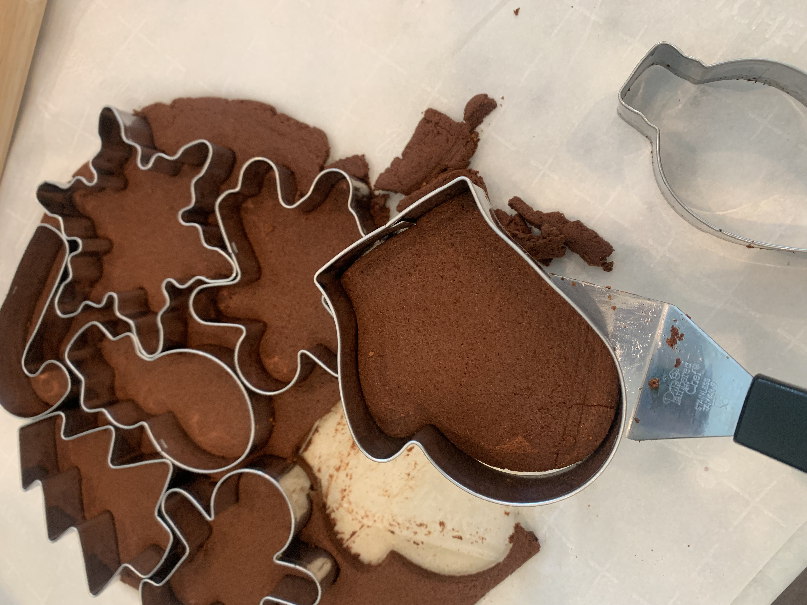

# Cinnamon Christmas Ornaments
**Yield:** 22 ornaments
**Prep Time:** 1 hr
**Cook Time:** 2 hrs

## Ingredients
- 2 cups cinnamon
- 2 cups apple sauce (sweetened but not sure if this matters)

## Procedure
### Bake the Ornaments
1. Preheat oven to 200 F
2. Mix cinnamon and apple sauce into dough
3.  Roll out between parchment paper to approximately 3/16-1/4" thickness
4.  Cut into shapes leaving cookie cutter in place
5.  Remove dough from around cookies
6.  transfer cookie in cookie cutter to parchment-lined baking sheet with thin spatula
7.  Remove cookie cutter
8.  Punch hole for ribbon with a straw
9.  Bake for 3 hrs or until hard and darkened

### Assemble
1. Cut string into 12" pieces
2. Form a loop and knot
3. Pass the loop of string through the hole in the ornament and then pass the knotted end through the loop

## Notes
 

 

 

 

 
