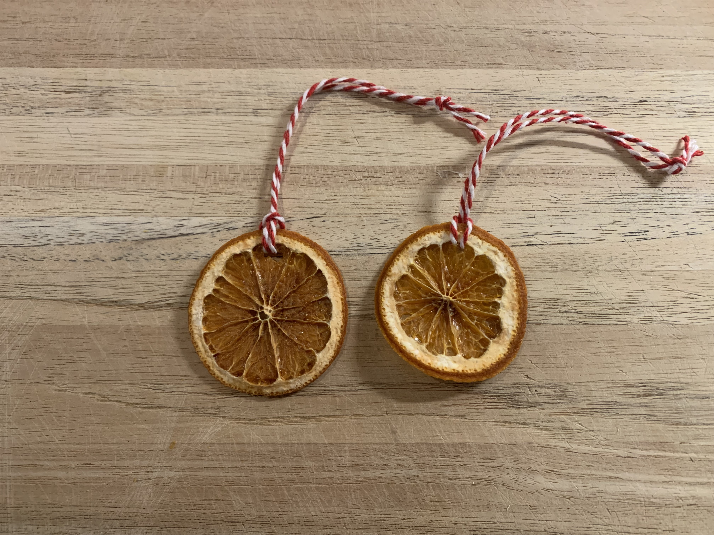

# Dried Orange Slices
**Yield:** 8 slices per orange
**Prep Time:** 15 min
**Cook Time:** 3 hrs

## Ingredients
- Mandarin or Navel oranges

## Procedure
1. Preheat oven to 170 F
2. Slice oranges latitudinally into 1/8-1/4" slices
3. Place orange slices on parchment paper on wire rack
4. Dry in oven. This can take several hours. 
5. Oranges should not have any remaining moisture

See [Cinnamon Christmas Ornaments](/Cinnamon%20Christmas%20Ornaments.md#assemble) for ornament assembly.

## Notes
A higher temperature dries the oranges faster but seems to cause the slices to brown more. 

 

 
