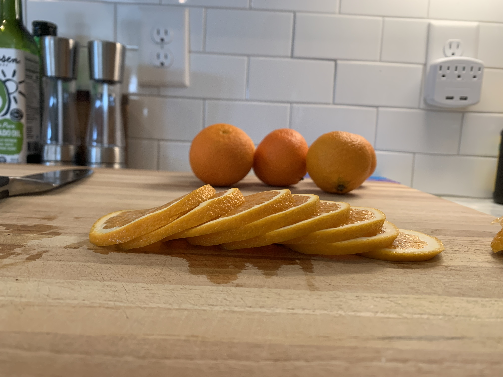

# Dried Orange Slices
**Yield:** #
**Prep Time:** 15 min
**Cook Time:** 3 hrs

## Ingredients
- Mandarin oranges

## Procedure
1. Preheat oven to 170 F
2. Slice oranges latitudinally into 1/8-1/4" slices
3. Place orange slices on parchment paper on wire rack
4. Dry in oven
5. Oranges should not have any remaining moisture

## Notes

 