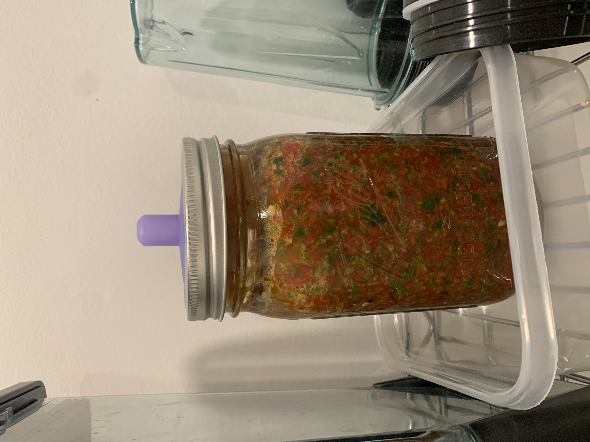
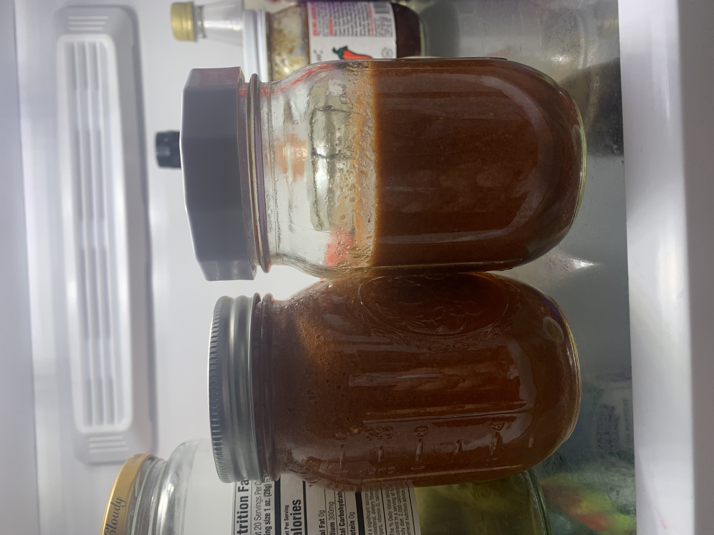

# Hot Sauce
**Yield:** 1 quart
**Prep Time:** 1 hour
**Cook Time:** 1 week

## Ingredients
- 150 g / 5.25 oz Habanero Peppers
- 400 g / 14 oz Jalapeno Peppers
- 16.5 g / 0.58 oz Salt (3%)
- 1 Garlic Clove (optional)

## Procedure
1. Prepare peppers
    1. Halve  Peppers
    1. Remove seeds and some membrane--enough to remove the seeds.  Some membrane should remain.
1. Chop peppers in food processor to make mash
1. Transfer to quart mason jar
1. Add liquid from Bubbies Pickles as a fermentation starter
1. Add a Ziploc bag of 3% brine to the top to prevent air contact
1. Let ferment for approximately a week. pH should be less than 4.5
1. Blend smooth when fermentation is complete
1. Refrigerate

## Notes
 

 
