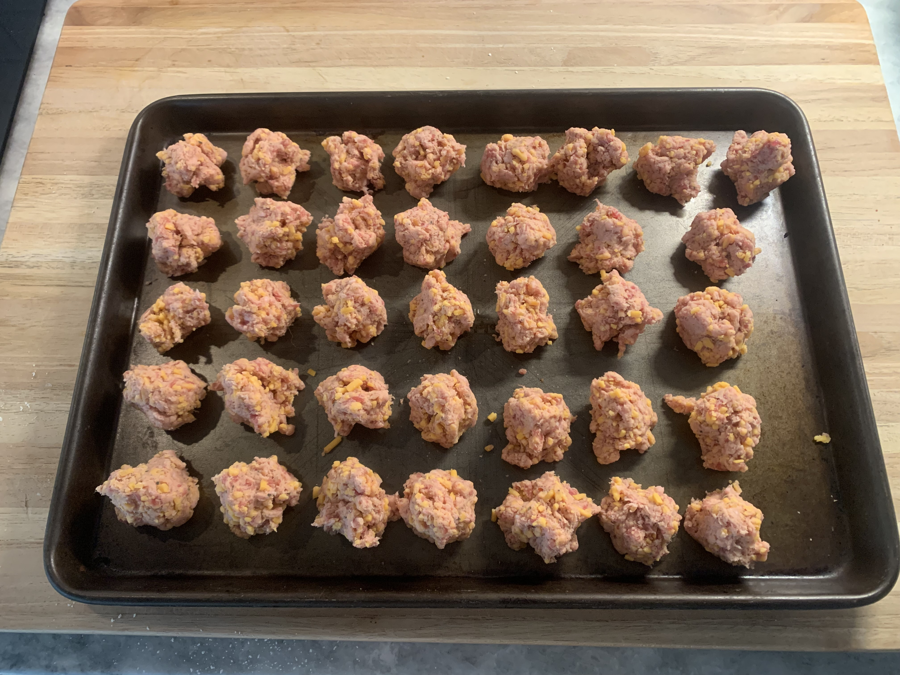
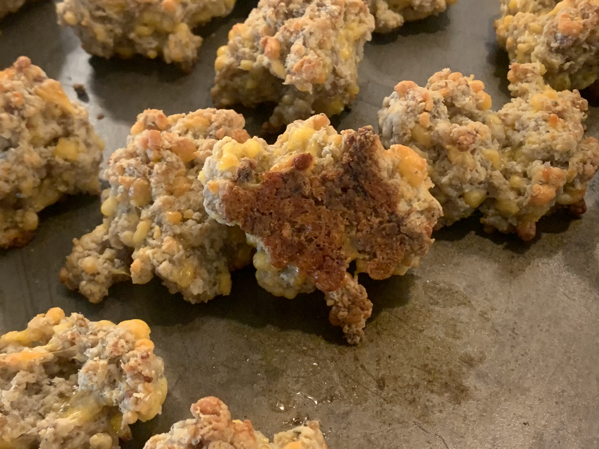

# Sausage Balls
**Yield:** 36
**Prep Time:** 20 min
**Cook Time:** 22 min

## Ingredients
- 1 lb hot breakfast sausage
- 2-2.5 cups Bisquick
- 2 cups sharp cheddar

## Procedure
1. Preheat oven to 350F
2. Mix cheese and Bisquick in a large bowl
3. Knead in sausage until all ingredients are completely mixed.  (It may not seem like all the cheese is going to mix in but it will.) You should end with a big ball of "dough"
4. Form "balls": Don't actually roll into balls.  Just pull chunks from the big dough ball.  Loosely form if needed. Should be roughly 1.5" in all dimensions.
5. Bake at 350F for 22 min until edges start to brown.

## Notes
 

 

 

**Source**: Mom