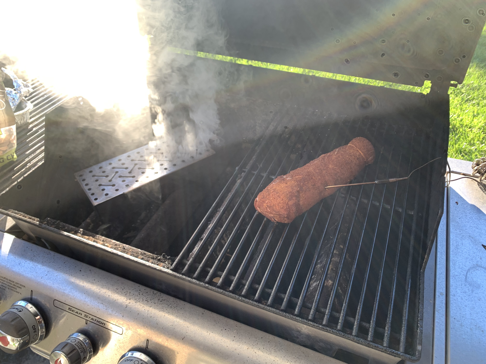

# Smoked Pork Tenderloin
**Yield:** 4 servings
**Prep Time:** 15 min
**Cook Time:** 2 hours

## Ingredients
- 1.5 lb pork tenderloin
- salt
- dry rub
- wood chips

## Procedure
**Prep grill**
1. Preheat wood chips in smoker box on high until smoking
2. Turn down to low once smoking
3. Grill should be around 225F.  (May end up being around 250F)

**Prep Tenderloin**
1. Pat dry tenderloin
2. Fold the narrow tip over and tie with butcher twine
6. Salt meat. Salt pretty heavily like you would a steak.  Might need to adjust based on the saltiness of the rub.
7. Apply a generous amount of rub

**Smoke**
1. Oil grill grates
2. Smoke meat until internal temp is 145F
3. Replenish wood chips as needed

## Notes
Left overs can be sliced and seared in butter in a skillet

