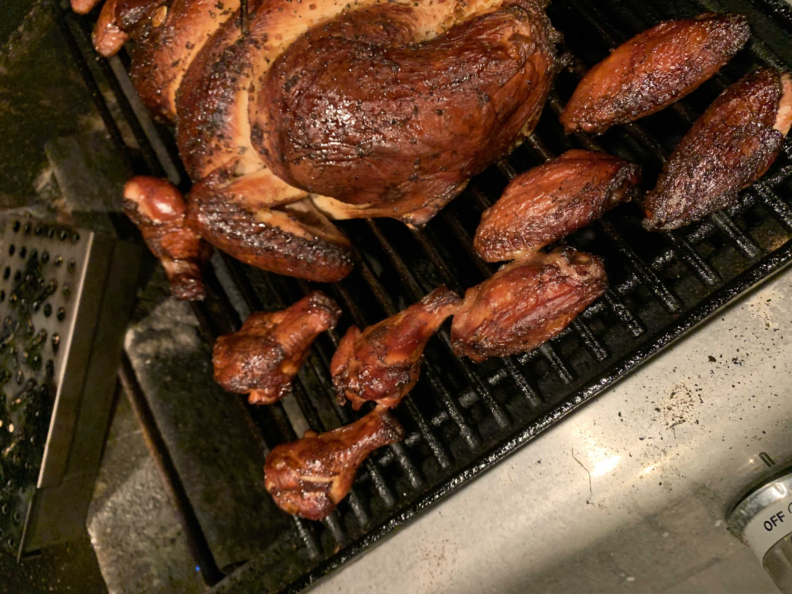

# Smoked Wings
**Yield:** 5-10 wings per person
**Prep Time:** 15 min
**Cook Time:** 2 hrs

## Ingredients
- chicken wings
- Salt
- Pepper

## Procedure
1. Pre heat smoker to 225-250F
2. Salt and pepper wings
3. Smoke for 2-2.25 hrs

## Notes
 
